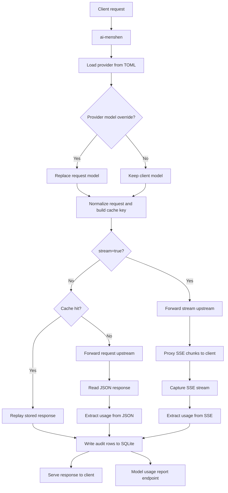
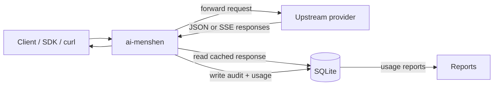

# ai-menshen

A small Go proxy service for OpenAI-compatible APIs with server-side auth injection, SQLite-backed request auditing, optional response reuse, and model-level token reports.

The name **menshen** (门神) comes from Chinese culture. A *menshen* is a "door guardian" or "gate guardian" figure placed at an entrance to protect what is behind it. That fits this project well: ai-menshen stands in front of an upstream AI provider, guards the real API key, and decides how requests should pass through.

> Pairs great with [OpenClaw](https://openclaw.ai/) 🦞.

## Features

- **Provider config via TOML**: load upstream settings from `config.toml`.
- **Auth injection**: keep real upstream API keys on the server.
- **Provider model override**: optionally replace the client-supplied `model` with `providers[0].model`.
- **Auditing**: persist request, response, latency, and token usage to SQLite.
- **Optional cache replay**: reuse previous non-stream responses for matching requests.
- **Usage reporting**: query model-level token totals at `GET /__report/models`.
- **Stream support**: `stream=true` is forwarded incrementally, recorded in SQLite, and can contribute usage stats when the stream includes usage data.

## How It Works



In short: ai-menshen can override the model, reuse safe non-stream responses from SQLite, forward misses to the upstream provider, and persist both normal and stream exchanges for later reporting.

## Architecture



This is the high-level picture: ai-menshen sits between clients and the upstream provider, can read cached responses from SQLite, writes audit and usage data back to SQLite, and exposes reports derived from the same database.

## Configuration

Create a `config.toml` file, or start from `configs/config.example.toml`:

```toml
listen = ":8080"
verbose = false

[[providers]]
base_url = "https://api.openai.com/v1"
api_key = "sk-..."
# Optional: override the client's model before forwarding upstream.
# model = "gpt-4.1"

[storage]
sqlite_path = "./data/ai-menshen.db"
retention_days = 30

[cache]
enable = true
max_body_bytes = 1048576

[logging]
log_request_body = true
log_response_body = true
```

Notes:

- `providers` is an array for future expansion, but the current implementation only uses `providers[0]`.
- If `providers[0].model` is set, that value replaces the incoming request's `model`.
- SQLite data is stored at `storage.sqlite_path`.
- The repository keeps the example config in `configs/config.example.toml`.

## Quick Start

### 1. Run

```bash
cp configs/config.example.toml ./config.toml

go run ./cmd/ai-menshen

# show CLI help
go run ./cmd/ai-menshen -h

# pass a custom config path
go run ./cmd/ai-menshen -config ./config.toml
```

### 2. Build

```bash
make build
```

### 3. Connect a Client

#### OpenAI Python SDK

ai-menshen still speaks the normal OpenAI-compatible HTTP API. Clients only need to point `base_url` at the local service; the upstream key stays in `config.toml`.

```python
from openai import OpenAI

client = OpenAI(
    base_url="http://localhost:8080",
    api_key="local-placeholder"
)

response = client.chat.completions.create(
    model="gpt-4.1-mini",
    messages=[{"role": "user", "content": "Hello via ai-menshen!"}]
)
print(response.choices[0].message.content)
```

#### curl

```bash
curl http://localhost:8080/chat/completions \
  -H "Content-Type: application/json" \
  -d '{"model":"gpt-4.1-mini","messages":[{"role":"user","content":"Hi!"}]}'
```

## Reports

Fetch aggregated usage by model:

```bash
curl http://localhost:8080/__report/models
```

Example response:

```json
[
  {
    "model": "gpt-4.1",
    "request_count": 12,
    "cache_hits": 3,
    "prompt_tokens": 240,
    "completion_tokens": 1900,
    "total_tokens": 2140,
    "cached_tokens": 80
  }
]
```

## Current Scope

- Auditing applies to both non-stream and stream requests.
- Stream requests are forwarded incrementally and can record usage from SSE `data:` events that include a `usage` object.
- Cache replay is still limited to supported **non-stream** JSON endpoints such as `/chat/completions` and `/responses`.
