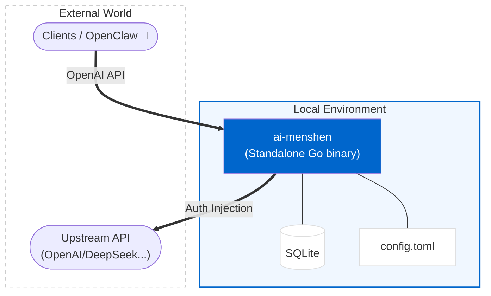
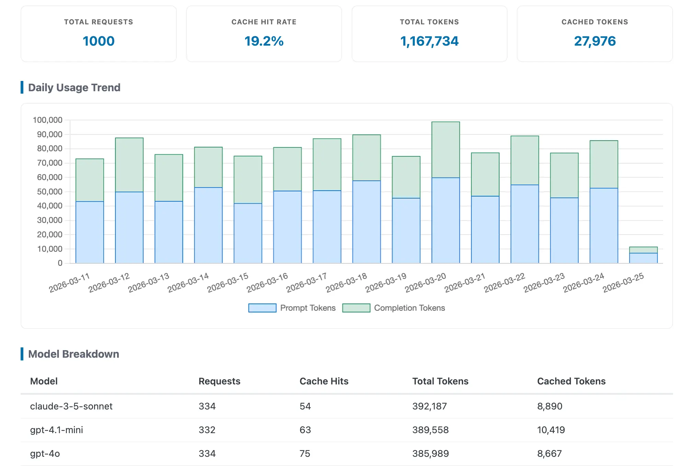
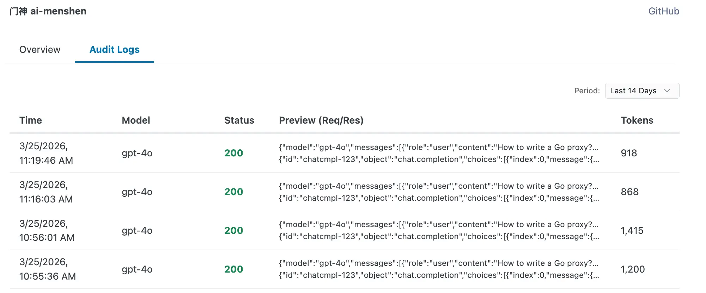

# ai-menshen

ai-menshen (门神) is a lightweight, local-first AI Gateway. It proxies any OpenAI-compatible API, providing **Auth Injection (BYOK)**, **Model Overriding**, **Usage Auditing**, and **Response Caching**—all while keeping your API keys and logs strictly under your control.

> *Single Go binary. Zero external dependencies besides SQLite.*



## Built-in Dashboard

ai-menshen ships with a lightweight, built-in dashboard at `http://localhost:8080/`.

Zero external CDN calls—all JS/CSS is embedded, making it ideal for offline or air-gapped environments.

| Overview & Trends | Audit Logs |
| :---: | :---: |
|  |  |

## Installation

### One-liner (Linux & macOS)

*Download and install the pre-built binary from GitHub Releases.*

```bash
curl -fsSL https://raw.githubusercontent.com/jiacai2050/ai-menshen/main/install.sh | sh
```

The script supports custom version and installation directory:
```bash
# Pass arguments using sh -s --
curl -fsSL https://raw.githubusercontent.com/jiacai2050/ai-menshen/main/install.sh | sh -s -- --version v1.0.0 --prefix /usr/local/bin
```

| Option | Description | Default |
| :--- | :--- | :--- |
| `--version`, `-v` | Release version to install | `latest` |
| `--prefix`, `-p` | Directory to install binary | `~/.local/bin` |
| `--china` | Use mirror for downloads (for users in China) | `false` |

### Via Go Install

```bash
go install github.com/jiacai2050/ai-menshen@latest
```

### From Source

```bash
git clone https://github.com/jiacai2050/ai-menshen.git
cd ai-menshen
make build
# The binary 'ai-menshen' will be available in the current directory
```

## Quick Start

1.  **Install binary** (choose one):
    *   [One-liner (Linux & macOS)](#one-liner-linux--macos)
    *   `go install github.com/jiacai2050/ai-menshen@latest`
    *   [From Source](#from-source)

2.  **Setup config**:
    ```bash
    mkdir -p ~/.config/ai-menshen
    # Generate the default config
    ai-menshen -gen-config > ~/.config/ai-menshen/config.toml
    # Edit with your upstream API key
    vi ~/.config/ai-menshen/config.toml
    ```

3.  **Run**:
    ```bash
    ai-menshen -config ~/.config/ai-menshen/config.toml
    ```

4.  **Connect**:
    Point your OpenAI client to `http://localhost:8080`.

    **REST API**:
    ```bash
    # `your-auth-token` should match [auth].token if auth.enable = true (can be anything if false)
    curl http://localhost:8080/chat/completions \
      -H "Content-Type: application/json" \
      -H "Authorization: Bearer your-auth-token" \
      -d '{
        "model": "gpt-4o",
        "messages": [{"role": "user", "content": "Hello!"}]
      }'
    ```

    **Python SDK**:
    ```python
    from openai import OpenAI

    client = OpenAI(
        base_url="http://localhost:8080",
        api_key="your-auth-token" # Match [auth].token if auth.enable = true (can be anything if false)
    )

    # Automatic usage auditing (even for streaming!)
    response = client.chat.completions.create(
        model="gpt-4o",
        messages=[{"role": "user", "content": "Hello!"}],
        stream=True
    )
    for chunk in response:
        print(chunk.choices[0].delta.content or "", end="")
    ```

## Run as Background Service (macOS)

A launchd plist is provided at [`configs/net.liujiacai.ai-menshen.plist`](configs/net.liujiacai.ai-menshen.plist).

```bash
# Install the service
cp configs/net.liujiacai.ai-menshen.plist ~/Library/LaunchAgents/

# Load and start
launchctl load ~/Library/LaunchAgents/net.liujiacai.ai-menshen.plist

# Stop and unload
launchctl unload ~/Library/LaunchAgents/net.liujiacai.ai-menshen.plist

# Check status
launchctl list | grep ai-menshen

# View logs
tail -f /tmp/ai-menshen-stderr.log
```

The service starts automatically on login and restarts on crash. It expects the binary at `~/.local/bin/ai-menshen` and config at `~/.config/ai-menshen/config.toml`.

## Configuration Guide

Customize `config.toml` (template: [configs/example.toml](configs/example.toml)). `api_key`, `password`, `token`, `headers` and `storage.sqlite.path` values support **Environment Variables** (e.g., `${KEY}`).

| Section | Field | Description | Default |
| :--- | :--- | :--- | :--- |
| **Global** | `listen` | Local bind address | `:8080` |
| **Auth** | `enable` | Enable authentication for gateway & dashboard | `false` |
| | `user` | Username for **Dashboard** (Basic Auth) | - |
| | `password` | Password for **Dashboard** (Basic Auth) | - |
| | `token` | Token for **API Requests** (Bearer Auth) | - |
| **Providers** | `base_url` | Upstream endpoint (Required) | - |
| | `api_key` | Upstream key | - |
| | `headers` | Custom headers (e.g., `{ "cf-aig-authorization" = "Bearer..." }`) | `{}` |
| | `model` | Force override request model | - |
| **Upstream** | `timeout` | Upstream request timeout (seconds) | `300` (5 min) |
| **Storage** | `retention_days` | Automatically purge logs older than X days | `90` |
| **Storage.SQLite** | `path` | SQLite database location | `./data/ai-menshen.db` |
| **Cache** | `enable` | Cache 200 responses | `true` |
| | `max_body_bytes` | Skip caching responses larger than this size (0 = no limit) | `5242880` (5 MiB) |
| | `max_age` | Cache TTL in seconds (0 = never expire) | `0` |
| **Logging** | `log_request_body` | Persist full request body in DB | `true` |
| | `log_response_body` | Persist full response body in DB (required for cache) | `true` |
