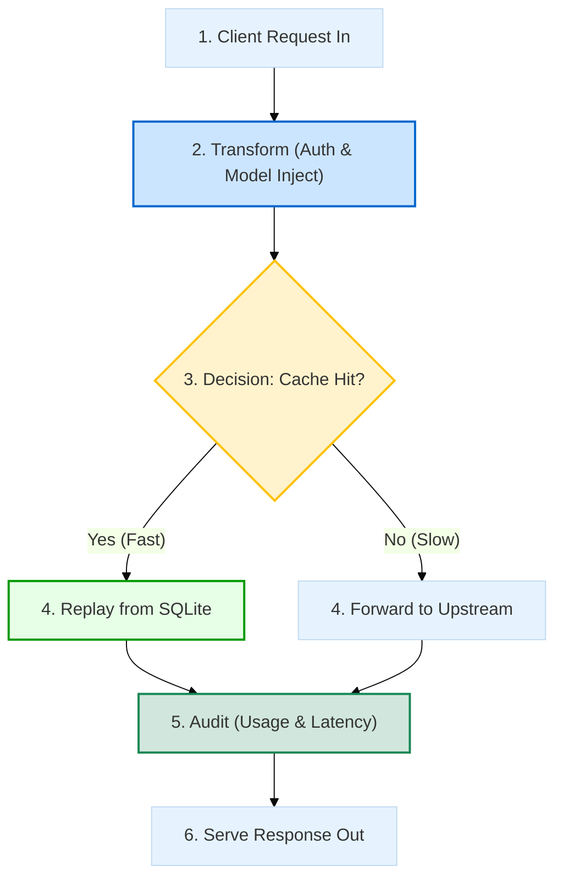
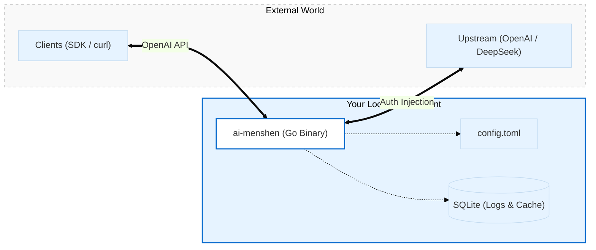

# ai-menshen

ai-menshen (门神) is a lightweight, local-first Go proxy for OpenAI-compatible APIs. It stands in front of upstream providers to keep auditing, caching, and API keys under your absolute control.

> Pairs great with [OpenClaw](https://openclaw.ai/) 🦞.

## Core Features

- **Auth Injection**: Keep real upstream API keys safe in your local config.
- **Model Override**: Force specific models (e.g., `gpt-4o`) regardless of client request.
- **Auditing**: Log every request, response, and token usage to a local **SQLite** database.
- **Smart Cache**: Instant replay for matching non-stream requests to save costs.
- **Stream Support**: Full SSE support with real-time token usage extraction.
- **Usage Reports**: Model-level token totals via `GET /__report/models`.

## How It Works



## Architecture



## Quick Start

### 1. Configure & Run
```bash
cp configs/example.toml config.toml
# Edit config.toml with your api_key and base_url
go run ./cmd/ai-menshen
```

### 2. Connect Your Client
Point your OpenAI client to `http://localhost:8080`.

```python
from openai import OpenAI
client = OpenAI(base_url="http://localhost:8080", api_key="local-placeholder")

response = client.chat.completions.create(
    model="any-model", # Will be overridden if a provider model is set in config.toml ([[providers]].model)
    messages=[{"role": "user", "content": "Hello!"}]
)
```

### 3. Check Reports
```bash
curl http://localhost:8080/__report/models
```

## Cloudflare AI Gateway (BYOK)

If you use Cloudflare AI Gateway with [Bring Your Own Keys (BYOK)](https://developers.cloudflare.com/ai-gateway/configuration/bring-your-own-keys/), you must provide your provider key via the `cf-aig-authorization` header. 

You can configure this using the `headers` map in `ai-menshen`:

```toml
[[providers]]
# Replace with your gateway's OpenAI endpoint
base_url = "https://gateway.ai.cloudflare.com/v1/ACCOUNT_ID/GATEWAY_NAME/openai"
# Inject the BYOK header
headers = { "cf-aig-authorization" = "Bearer sk-..." }
```

## Configuration (config.toml)

ai-menshen supports environment variable expansion (e.g., `${API_KEY}`) within your `config.toml`, making it easy to keep your secrets out of the configuration file.

```toml
listen = ":8080"

[[providers]]
base_url = "https://gateway.ai.cloudflare.com/v1/ACCOUNT_ID/GATEWAY_NAME/openai"
# Custom headers (BYOK for Cloudflare)
headers = { "cf-aig-authorization" = "Bearer ${DEEPSEEK_API_KEY}" }
model = "gpt-4o"

[storage]
sqlite_path = "./data/ai-menshen.db"

[cache]
enable = true
```
