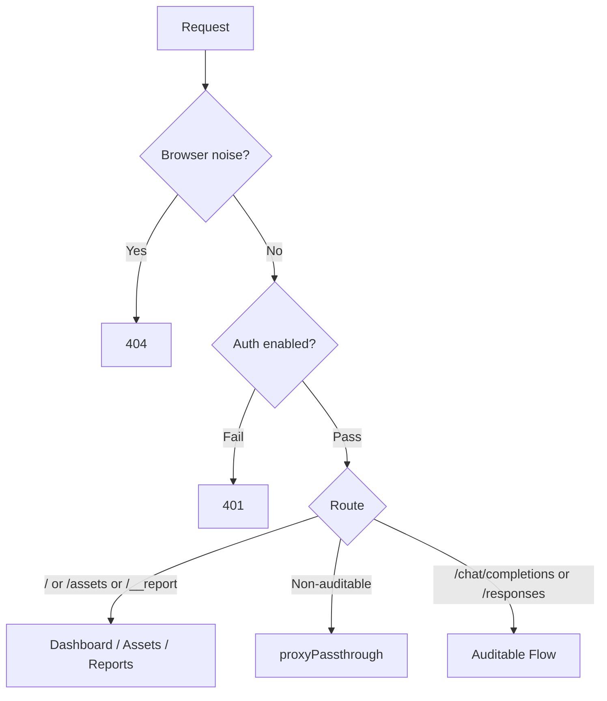
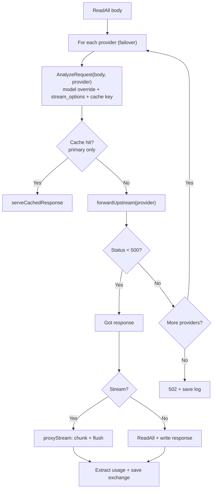

# Proxy Request Flow

## Routing

## Auditable Request Flow

### Failover loop

Iterates `failoverProviders()` (single provider if failover disabled). For each provider:

1. `AnalyzeRequest` — applies model override, injects `stream_options`, builds cache key, marshals body.
2. Cache lookup (primary provider only, i == 0) — hit returns immediately.
3. `forwardUpstream` — builds URL, injects provider auth/headers, sends request.
4. Status < 500 → break with success. 5xx/error → close body, try next provider.

### Response handling

After the loop, `ServeHTTP` checks the result:
- `resp == nil` → all providers failed, 502
- Stream → `proxyStream(resp)` — chunked streaming with SSE usage extraction
- Non-stream → read full body, extract usage, write response

## Design Principles

- **`AnalyzeRequest` is idempotent** — called per provider attempt, no shared state mutation
- **Failover is a simple loop** — no extra structs or abstractions
- **`proxyStream` receives an already-established `resp`** — failover happens before streaming begins
