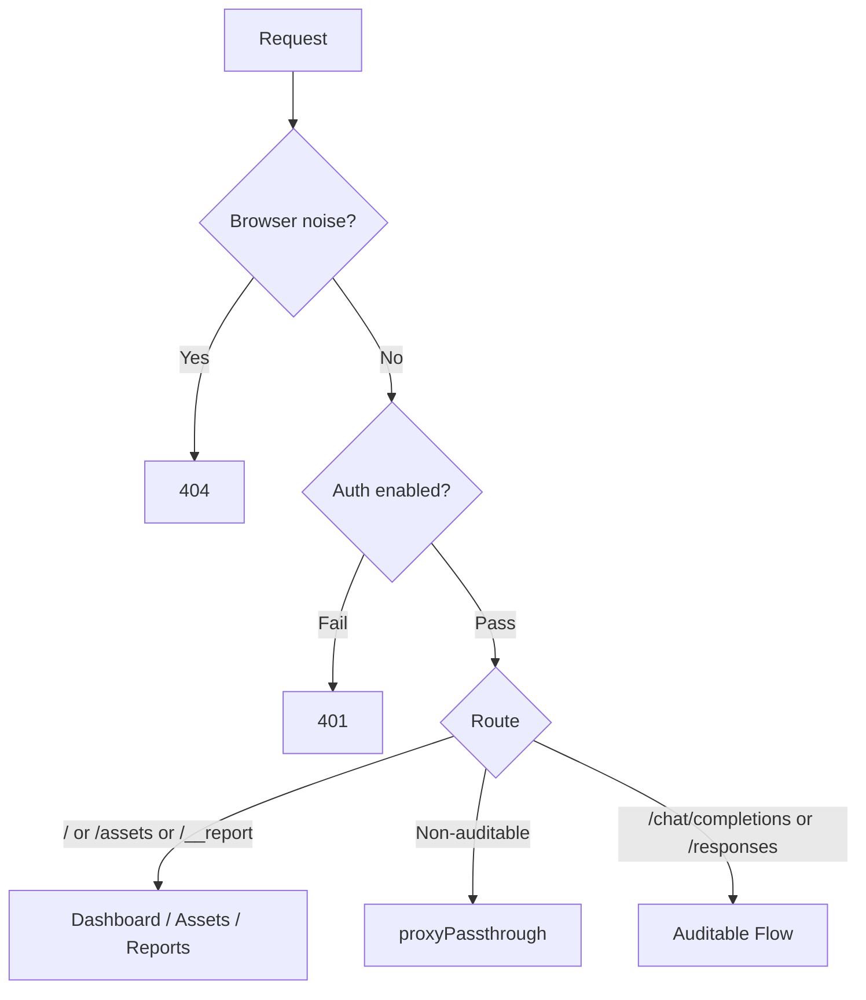

# Proxy Request Flow

## Routing

## Auditable Request Flow

```mermaid
flowchart TD
    AUDIT[ReadAll body] --> PICK["pickProvider()<br/>weighted-random selection"]
    PICK --> ANALYZE["AnalyzeRequest(body, provider)<br/>model override + stream_options + cache key"]
    ANALYZE --> CACHE{Cache hit?}
    CACHE -->|Yes| R1[serveCachedResponse]
    CACHE -->|No| UPSTREAM["forwardUpstream(provider)"]
    UPSTREAM --> RESP[Got response or upstream error]
    RESP --> STREAM{Stream?}
    STREAM -->|Yes| R3[proxyStream: chunk + flush]
    STREAM -->|No| R4[ReadAll + write response]
    R3 --> SAVE[Extract usage + save exchange]
    R4 --> SAVE
```

### Provider selection

`pickProvider()` selects one provider for each request:

1. Filter out providers with `weight = 0` (disabled).
2. `weightedPick()` randomly selects among active providers proportional to weight.
3. If only one active provider remains, it is used directly.
4. If all providers are configured with `weight = 0`, the first provider is used as a defensive fallback.

### Response handling

After provider selection, `ServeHTTP`:
- performs request analysis and cache lookup for that provider
- forwards the request upstream once
- returns `502` if the upstream request itself fails
- Stream → `proxyStream(resp)` — chunked streaming with SSE usage extraction
- Non-stream → read full body, extract usage, write response

## Design Principles

- **`AnalyzeRequest` is idempotent** — safe to run after provider selection without mutating shared state
- **Weighted load balancing is request-scoped** — each request chooses one active provider
- **`proxyStream` receives an already-established `resp`** — stream handling stays focused on copying and usage extraction
- **`weight = 0` disables a provider from weighted selection** without removing its config entry
