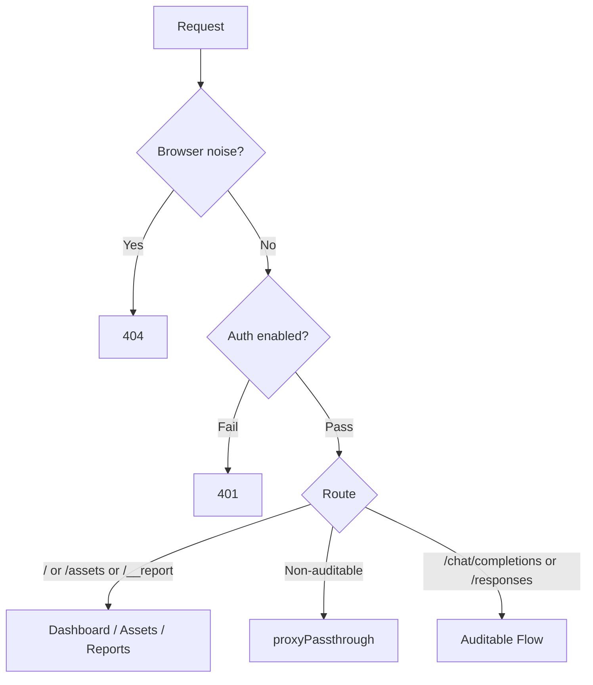
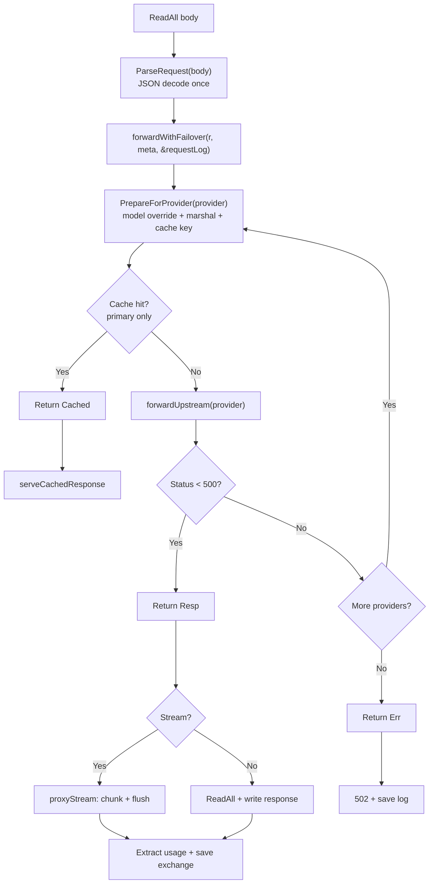

# Proxy Request Flow

## Routing

## Auditable Request Flow

### ParseRequest (once, provider-independent)

Single JSON decode. Extracts `stream` and `model`, injects `stream_options` for streaming. Retains the parsed payload map for reuse.

### forwardWithFailover

Iterates providers (single if failover disabled). For each provider:

1. `PrepareForProvider` — applies model override (clones map if needed), builds cache key, marshals body. Fills `requestLog` fields.
2. Cache lookup (primary provider only) — hit returns immediately.
3. `forwardUpstream` — builds URL, injects provider auth/headers, sends request.
4. Non-5xx → return success. 5xx/error → try next provider.

### Response handling (caller)

`ServeHTTP` dispatches on the `forwardResult`:
- `Cached` → serve from cache
- `Err` → 502
- `Resp` + stream → `proxyStream` (chunked streaming with SSE usage extraction)
- `Resp` + non-stream → read full body, extract usage, write response

## Design Principles

- **Single JSON decode** — `ParseRequest` parses once, payload map reused across providers
- **One marshal per provider attempt** — only in `PrepareForProvider`
- **No shared mutation** — model override clones the payload map
- **`forwardWithFailover` never touches `ResponseWriter`** — returns data, caller writes
